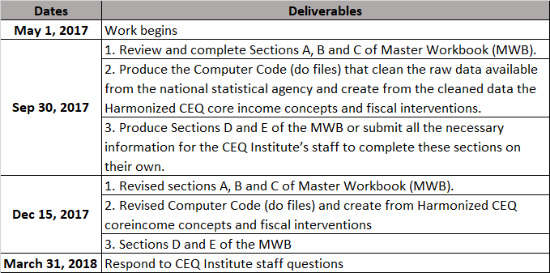

# Welcome to Frequently Asked Questions on CEQ Re-runs 2017-2018

[Documents](#Important) •  [CEQ Stata Package?](#How) •  [MWB templates?](#Where) •  [Changes in CEQ Handbook July 2017](#Changes) •  [Important dates](#dates)

### <a name="Important"></a> Important documents 
- [CEQ Handbook](http://www.commitmentoequity.org/publications-ceq-handbook/)
- [A guide to name variables](guide_3_Jul_2017.pdf)
- [CEQ Manual for Writing Do Files - Prepared by Sean Higgins](CEQ_Manual.pdf) 

### <a name="How"></a> How to update CEQ Stata Package? 
```markdown
ssc install ceq, replace
```

### <a name="Where"></a> Where are the last versions of Master Workbook templates? 
- [Section ABC](https://goo.gl/AFWhsM)
- [Section D - Linking](https://goo.gl/2rwXgB)
- [Section E](https://www.dropbox.com/sh/ph6e59z84dba08g/AAAcrHBO8Ouox3Q5UxchWDUqa?dl=0)

### <a name="Changes"></a> Changes in new CEQ Handbook (Version July 2017)
- CEQ Income definitions
- In-Kind Transfers
- Using only current expenditures in Health and Education In-Kind Transfers

### <a name="dates"></a> Important dates


### Upcoming documents
- Stata code to run ado files


### Support or Contact

Having trouble with CEQ Re-runs? Please contact Sandra Martinez (sandra.martinez@ceqinstitute.org) or Maynor Cabrera(maynor.cabrera@ceqinstitute.org)
